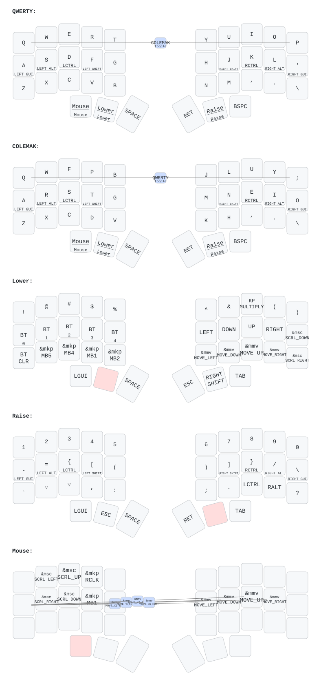
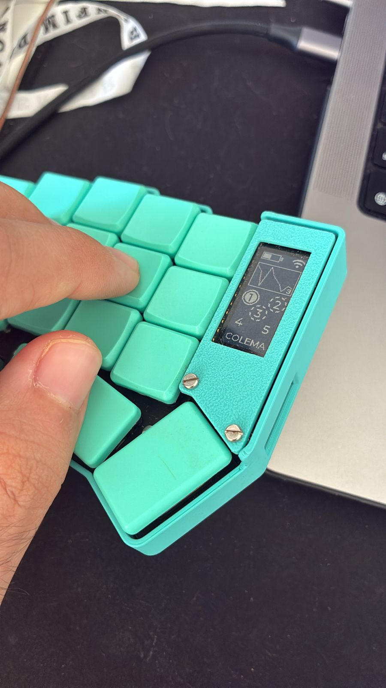
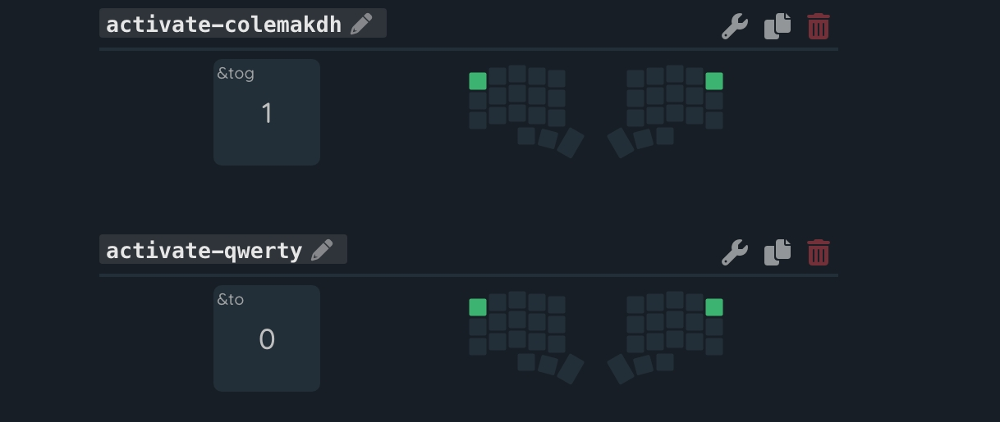

# 5-Column Split Keyboard with Nice View



## Colemak

The Colemak-DH Layout was added to be used in parallel of the default layer with QWERTY as I **can't** fully change yet. To enable it a combo with keys equivalent of 'Q' and 'P' were added on both layers to back and forth between the layouts.
The layout change is stationary so momentary layer is not affected.

Typeractive Corne with Colemak-DH layer:


Combos:


## Diagram generator


For local generation use the bellow but the dark mode is handled on the website with the ZMK link parse.

```bash
keymap parse -c 10 -z ./config/corne.keymap >sweep_keymap.yaml
keymap draw sweep_keymap.yaml > visualizer.svg
```

## Keymap editor


Thanks a lot to the free online available editor that easily connects with the repo and enable the visual edit of the configs.

* https://nickcoutsos.github.io/keymap-editor/ ♥️

## doc

[home row mods](https://www.youtube.com/watch?v=EQCaQBlv1UM)
[key reader](https://w3c.github.io/uievents/tools/key-event-viewer.html)
